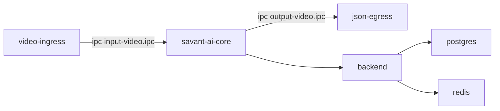

# SV-PRO Service Inventory (Compose)

Nguồn: [`docker-compose.yml`](../../docker-compose.yml) và [`module/module.yml`](../../module/module.yml).

## Critical path (end-to-end)

## Service table

| Service | Image/Build | Ports | Volumes (stateful) | Healthcheck | Notes |
|---|---|---|---|---|---|
| `video-ingress` | `ghcr.io/insight-platform/savant-adapters-gstreamer:latest` | - | `zmq-sockets:/tmp/zmq-sockets` | - | Dummy stream (SMPTE) → ZMQ input IPC |
| `savant-ai-core` | `ghcr.io/insight-platform/savant-deepstream:latest` | `8080:8080` | `./models:/models`, `./Detect:/Detect`, `zmq-sockets:/tmp/zmq-sockets` | `GET http://localhost:8080/health` | DeepStream pipeline theo `module/module.yml` |
| `json-egress` | `ghcr.io/insight-platform/savant-adapters-py:latest` | - | `./output:/output`, `zmq-sockets:/tmp/zmq-sockets` | - | Writes JSON metadata to `/output` |
| `postgres` | `pgvector/pgvector:pg16` | `5432:5432` | `pgdata:/var/lib/postgresql/data` | `pg_isready` | Vector DB (pgvector) |
| `db-init` | `pgvector/pgvector:pg16` | - | `./scripts/sql:/sql` | - | One-shot migrations (depends on `postgres`) |
| `redis` | `redis:7-alpine` | `6379:6379` | `redis_data:/data` | `redis-cli ping` | Hot cache |
| `backend` | `Dockerfile.backend` | `8000:8000` | - | `GET http://localhost:8000/health` | REST API + `/metrics` for Prometheus |
| `prometheus` | `prom/prometheus:v2.51.0` | `9090:9090` | `prometheus_data:/prometheus` | `GET /-/healthy` | Scrapes backend + ai-core + exporters |
| `grafana` | `grafana/grafana:10.4.0` | `3001:3000` | `grafana_data:/var/lib/grafana` | `GET /api/health` | Provisioned dashboard + datasource |
| `redis-exporter` | `oliver006/redis_exporter:v1.59.0` | `9121:9121` | - | - | Exposes Redis metrics |
| `postgres-exporter` | `prometheuscommunity/postgres-exporter:v0.15.0` | `9187:9187` | - | - | Exposes Postgres metrics |

